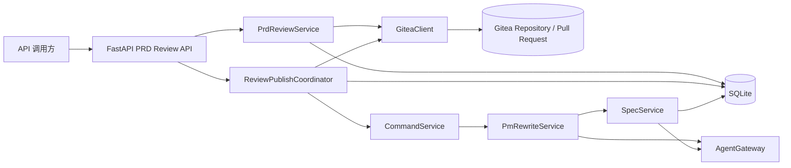
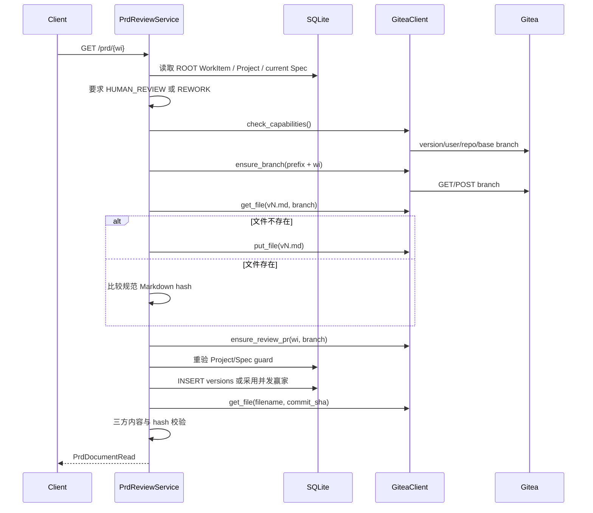
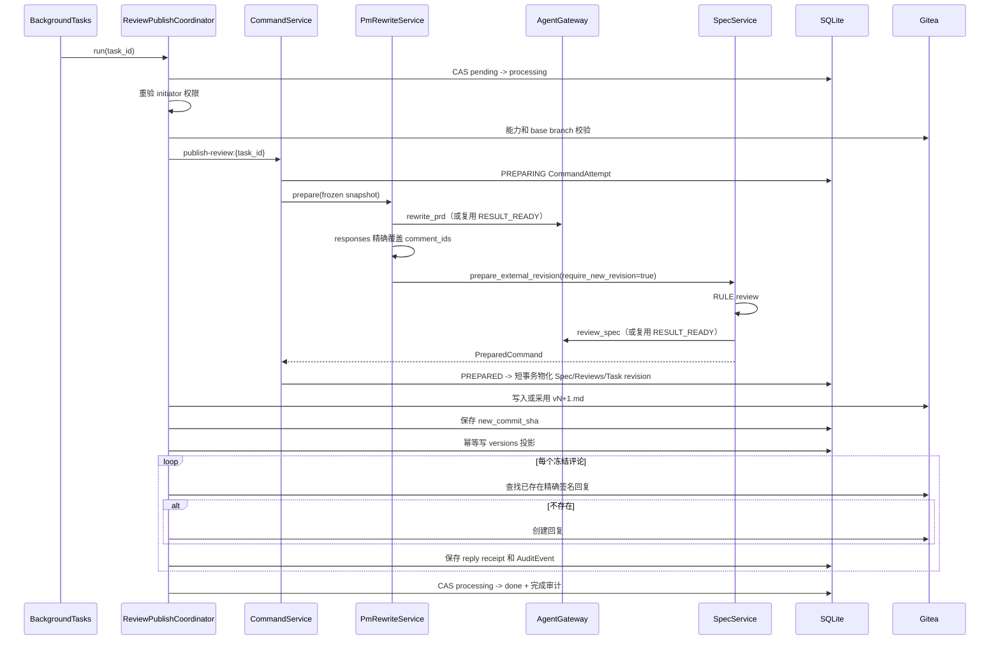
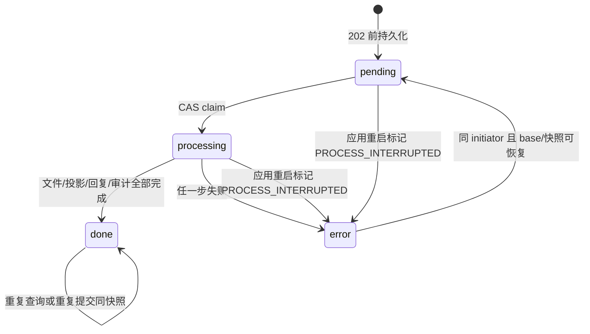
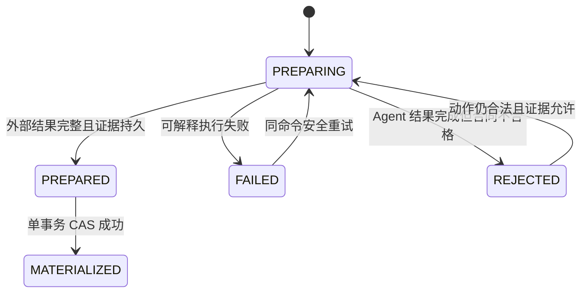

# firstFlight Gitea PRD 批注评审工程说明

## 1. 文档信息

| 项目 | 内容 |
| --- | --- |
| 文档目的 | 说明 Gitea PRD 评审子系统的接口、数据、状态、核心逻辑、一致性、恢复、安全、部署和测试方法 |
| 适用读者 | 后端开发、代码审查者、测试工程师、部署运维人员、后续维护者 |
| 实现基线 | `codex/gitea-prd-review-mvp@472af4980cb66792dd7a557f97fefc39ca668d85` |
| 技术栈 | Python 3.12、FastAPI、Pydantic v2、SQLAlchemy、SQLite、httpx、pytest |
| 主要入口 | `main.py`、`app/api/prd_review.py` |
| 设计来源 | `docs/superpowers/specs/2026-09-01-gitea-prd-review-mvp-design.md` |
| 实施计划 | `docs/superpowers/plans/2026-09-01-gitea-prd-review-mvp.md` |

本文只描述仓库中已经实现的行为。文末“扩展建议”属于未来演进方向，不代表当前系统已经支持。

---

## 2. 范围与非目标

### 2.1 解决的问题

该子系统把 firstFlight 内部不可变 `SpecVersion` 映射为 Gitea 仓库中的 Markdown PRD 文件，并使用一个长期打开的 Pull Request 承载行内批注。授权评审人可以：

1. 查看当前或历史 PRD；
2. 在 PRD diff 的有效新文件行上创建批注；
3. 回复、解决或恢复批注；
4. 冻结当前未解决批注，触发一次 PM Agent 改写；
5. 生成不可变的下一版 `SpecVersion`；
6. 运行既有 RULE + Reviewer Agent 自动审核；
7. 把新版本写回 Gitea，并逐条发布可验证的 Agent 回复；
8. 查询发布任务的最终状态。

### 2.2 明确非目标

- 不提供前端页面。
- 不使用 Webhook、SSE、WebSocket 或轮询监听 Gitea 事件。
- 不使用消息队列或跨进程任务执行器。
- 不执行由 Agent Spec 描述的子 Agent。
- 不在 PRD 接口中执行人工 `approve`、`reject`、`rework` 或 `convert_to_work_item`。
- 不把 Gitea token 暴露给客户端。
- 不支持多进程或多个 uvicorn worker 共同处理发布任务。

### 2.3 权威边界

| 数据 | 权威来源 | SQLite 的角色 |
| --- | --- | --- |
| PRD Markdown 文件 | Gitea 指定 commit 下的文件内容 | 保存版本映射和内容 hash |
| 批注、回复、解决状态 | Gitea Pull Request review comments | `comments_index` 仅作可重建查询索引 |
| 项目工作流和 Spec 状态 | firstFlight `Project`、`SpecVersion`、`SpecReview` | 业务权威 |
| 发布任务快照和恢复证据 | `ReviewTask`、`CommandAttempt`、`AgentCall` | 持久化权威 |
| Agent 回复真实性 | Gitea live reply + 本地 receipt + 服务身份 + HMAC | 保存可验证回执 |

---

## 3. 系统上下文与总体架构



核心设计是“桥接而非替代”：

- `PrdReviewService` 负责 Gitea 与当前 Spec 的绑定、读取和人工批注写操作。
- `ReviewPublishCoordinator` 负责冻结批注、创建任务、编排下一版发布及部分副作用恢复。
- `PmRewriteService` 把一次冻结任务转换为内部 `publish_review` 两阶段命令。
- `SpecService` 继续负责不可变 Spec、结构规则审核、Reviewer Agent 审核和审核结果物化。
- `CommandService` 提供命令幂等、乐观并发、外部调用检查点和短事务物化。
- `GiteaClient` 是唯一的 Gitea HTTP 适配层，不维护本地 Git checkout。

实现位置：

- 应用装配：`main.py::create_app`
- HTTP 路由：`app/api/prd_review.py::build_router`
- Gitea 适配：`app/services/gitea.py::GiteaClient`
- PRD 绑定和评论：`app/services/prd_review.py::PrdReviewService`
- 发布协调：`app/services/pm_agent.py::ReviewPublishCoordinator`
- PM 改写：`app/services/pm_agent.py::PmRewriteService`
- Spec 审核：`app/services/spec_service.py::SpecService.prepare_external_revision`
- 两阶段命令：`app/services/command_service.py::CommandService`

---

## 4. 模块职责

| 模块 | 主要职责 | 不承担的职责 |
| --- | --- | --- |
| `app/api/prd_review.py` | 路由、HTTP 状态码、稳定错误消息、BackgroundTasks 调度 | 不直接访问数据库或 Gitea |
| `app/schemas/prd_review.py` | 请求/响应 DTO、长度约束、纯文本标准化、禁止额外字段 | 不做项目级权限判断 |
| `app/services/gitea.py` | Gitea REST、响应验证、分页、diff 行校验、HMAC | 不理解 Project/Spec 工作流 |
| `app/services/prd_review.py` | 根 WorkItem 解析、评审权限、版本绑定、评论过滤/索引 | 不调用 PM Agent |
| `app/services/pm_agent.py` | 快照、改写合同、发布任务、文件/回复/投影恢复 | 不直接批准 Spec |
| `app/services/spec_service.py` | 新 Spec 准备、RULE/AGENT 审核、不可变版本物化 | 不访问 Gitea |
| `app/services/command_service.py` | 命令幂等、状态版本 CAS、两阶段准备/物化、AgentCall 证据 | 不包含具体 PM 改写业务 |
| `app/database/models.py` | ORM 表和约束 | 不执行业务校验 |
| `app/database/database.py` | SQLite 初始化和向前迁移 | 不执行在线跨数据库迁移 |
| `app/domain/workflow.py` | 公开和内部动作合法性 | 不执行动作副作用 |

依赖方向保持单向：HTTP 边界依赖服务，服务依赖领域与持久化，Gitea 适配不反向依赖业务服务。

---

## 5. 领域模型与持久化

### 5.1 相关既有模型

#### `Project`

实现：`app/database/models.py::Project`

与 PRD 评审相关的字段：

- `phase`：当前项目阶段。
- `state_version`：命令乐观并发版本。
- `current_spec_version_id`：当前 Spec。
- `final_approver`、`project_manager_ids`、`root_owner_ids`：可执行 PRD 写操作的责任人集合。

#### `SpecVersion`

实现：`app/database/models.py::SpecVersion`

- `(project_id, revision)` 唯一。
- `content` 是结构化 `ProjectSpecPayload`。
- `markdown` 是由结构化内容渲染出的 PRD 文本。
- `content_hash` 是结构化 JSON 的规范 hash，不是 Markdown hash。
- `parent_version_id` 建立不可变版本链。
- PRD publish 使用 `generation_source="GITEA_REVIEW_COMMENTS"`。

#### `SpecReview`

实现：`app/database/models.py::SpecReview`

每个新 Spec 至少包含：

- `kind="RULE"` 的确定性结构审核；
- `kind="AGENT"` 的 Reviewer Agent 审核，或结构失败时的 `SKIPPED` 记录。

PRD publish 不创建人工通过记录，最终仍停在人工门禁前。

### 5.2 `versions`：PRD 版本投影

ORM：`app/database/models.py::PrdVersion`

| 字段 | 含义 |
| --- | --- |
| `wi` | 根 WorkItem ID；复合主键之一 |
| `version` | 对应 `SpecVersion.revision`；复合主键之一 |
| `spec_version_id` | 内部不可变 Spec ID；唯一 |
| `filename` | Gitea 文件路径，固定为 `docs/prd/{wi}/v{version}.md` |
| `pr_number` | 长期评审 PR 编号 |
| `commit_sha` | 该版本文件可验证的 Gitea commit |
| `content_hash` | NFC + LF 规范化 Markdown 的 SHA-256 |
| `spec_content_hash` | 对应 `SpecVersion.content_hash` 的结构化 hash |
| `change_summary` | 版本变更摘要 |

完整性约束：

- `(wi, version)` 唯一；
- `spec_version_id` 唯一；
- 文件路径、两个 hash、revision、commit、PR 编号必须同时与 Spec 和 Gitea 内容一致。

### 5.3 `comments_index`：评论索引

ORM：`app/database/models.py::CommentIndex`

该表保存顶层 Gitea 评论的 ID、PR、路径、行号、正文和解决状态。它不是评论权威：`GET /prd/{wi}/comments` 每次先读 Gitea，再刷新索引。若同一 Gitea comment ID 已归属其他 `wi` 或 PR，服务返回内容冲突。

### 5.4 `tasks`：发布任务

ORM：`app/database/models.py::ReviewTask`

| 字段 | 含义 |
| --- | --- |
| `id` | 发布任务 ID |
| `wi` | 根 WorkItem |
| `initiator_actor_id` | 接受任务时的发起责任人；恢复时必须是同一 actor |
| `status` | `pending`、`processing`、`done`、`error` |
| `base_version` | 冻结时的 PRD/Spec revision |
| `base_commit_sha` | 冻结时评审分支 commit |
| `comment_ids` | 按显示顺序冻结的顶层评论 ID |
| `comment_snapshot` | 评论及回复的完整不可变输入 |
| `comment_snapshot_hash` | 规范化快照 hash |
| `reply_receipts` | 每条 Agent 回复的 Gitea reply ID、服务 user ID 和精确正文 |
| `new_version` | 已物化的新 revision |
| `new_spec_version_id` | 已物化的新 Spec ID |
| `new_commit_sha` | 新文件写入后的 Gitea commit |
| `error_code`、`error` | 内部错误分类和受限详情 |

唯一约束 `(wi, base_version, comment_snapshot_hash)` 保证同一冻结证据只有一个任务。

### 5.5 命令和外部调用证据

| 表 | 作用 |
| --- | --- |
| `command_attempts` | 两阶段命令准备状态：`PREPARING`、`PREPARED`、`MATERIALIZED`、`FAILED`、`REJECTED` |
| `processed_commands` | 成功命令回执；同一 Session 的 `command_id` 唯一 |
| `agent_calls` | PM rewrite 和 Reviewer Agent 的请求、响应、状态及绑定证据 |
| `audit_events` | 命令、回复和发布完成的审计事件 |

实现：`app/database/models.py::CommandAttempt`、`ProcessedCommand`、`AgentCall`、`AuditEvent`。

### 5.6 SQLite 迁移

实现：`app/database/database.py::_migrate_sqlite_gitea_review_contracts`

启动初始化会：

1. 检测旧 `versions` 是否缺少 `spec_content_hash`；
2. 在 `BEGIN IMMEDIATE` 事务中重建表；
3. 从关联 `spec_versions.markdown` 重新计算 Markdown hash；
4. 把旧结构化 hash 保存到 `spec_content_hash`；
5. 检测旧 `tasks` 是否缺少 `initiator_actor_id` 或 `reply_receipts`；
6. 使用项目 `final_approver` 对历史任务做确定性 actor 回填；
7. 为 `command_attempts` 增加准备 owner 字段。

迁移缺少关联 Spec、项目或 actor 时失败并回滚。当前迁移实现只面向本项目支持的 SQLite 部署。

---

## 6. 配置与应用生命周期

### 6.1 环境变量

实现：`app/config.py::Settings`

| 变量 | 默认值 | 说明 |
| --- | --- | --- |
| `GITEA_URL` | 无 | Gitea 根地址；可带或不带 `/api/v1` |
| `GITEA_TOKEN` | 无 | 服务账号 token；同时用于 API 和回复 HMAC |
| `GITEA_OWNER` | 无 | 仓库 owner |
| `GITEA_REPO` | `docs` | 仓库名 |
| `GITEA_BASE_BRANCH` | `main` | PR base 和评审分支来源 |
| `GITEA_REVIEW_BRANCH_PREFIX` | `prd-review/` | 评审分支前缀 |
| `GITEA_TIMEOUT_SECONDS` | `20` | connect/read/write/pool timeout |

`GITEA_URL`、`GITEA_TOKEN`、`GITEA_OWNER` 任一为空时，首次 PRD 操作返回 `GITEA_NOT_CONFIGURED`。

### 6.2 启动流程

实现：`main.py::create_app`

1. 创建或注入 `AgentGateway`、数据库 Session factory 和 `GiteaClient`。
2. 构造 `PrdReviewService` 和 `ReviewPublishCoordinator`。
3. FastAPI lifespan 启动时运行 `init_database`。
4. 把遗留 `pending/processing` ReviewTask 标为 `PROCESS_INTERRUPTED`。
5. 注册 Session、Chat 和 PRD Review 路由。
6. 关闭时只关闭由应用自己创建的 Gitea client；注入 client 的生命周期归注入方。

启动不会访问 Gitea。能力预检只在第一次实际 PRD 操作中懒执行。

### 6.3 首次能力预检

实现：`app/services/gitea.py::GiteaClient.check_capabilities`

预检通过 async lock 保证进程内只执行一次，并缓存服务身份：

1. `GET /api/v1/version`，要求版本至少 `1.27.0`；
2. `GET /api/v1/user`，获取正整数 user ID 和非空 login；
3. `GET /api/v1/repos/{owner}/{repo}`，要求 `permissions.pull == true` 且 `permissions.push == true`；
4. `GET /api/v1/repos/{owner}/{repo}/branches/{base}`，验证 base branch 和 `commit.id`。

权限或版本在缓存成功后发生变化，会由后续正常 Gitea 请求错误暴露，直到进程重启后重新预检。

---

## 7. HTTP 通用合同

### 7.1 URL 和认证现状

PRD 路由没有统一前缀，直接挂载在应用根路径。

当前 MVP 没有认证中间件。`actor_id` 是调用方声明的责任人标识，不是可信登录身份。服务只会把该值与项目中持久化的责任人集合比较。因此生产部署必须在 firstFlight 之前增加可信身份代理，或由受信后端代填 `actor_id`。

### 7.2 请求验证

实现：`app/schemas/prd_review.py`

- 所有请求模型 `extra="forbid"`，未知字段返回 422。
- `actor_id` 长度 1～255。
- 评论/回复 `text` 长度 1～4000。
- `anchor` 可选，最长 4000。
- 文本会 `strip()`，拒绝空白和 NUL。
- 创建评论的 `line > 0`。
- 人工回复必须显式传 `author_type: "human"`；调用方不能声明自己是 Agent。

验证失败统一返回：

```json
{
  "detail": {
    "code": "VALIDATION_ERROR",
    "message": "request validation failed",
    "errors": []
  }
}
```

### 7.3 业务错误结构

所有 PRD 业务错误采用：

```json
{
  "detail": {
    "code": "STABLE_ERROR_CODE",
    "message": "Public safe message"
  }
}
```

错误消息不包含 token、Gitea URL、响应正文、命令输出或内部 exception 详情。

---

## 8. REST API 详细合同

### GET /prd/{wi}

**作用：** 获取根 WorkItem 当前 Spec 对应的 PRD。

**重要语义：** 该 GET 在首次访问时会懒建立 Gitea 绑定，因此可能创建评审分支、`vN.md` 文件、Pull Request 和本地 `versions` 行。它不是严格无副作用的缓存读取。

**路径参数：**

- `wi`：必须是 `kind=ROOT` 且 `parent_id is null` 的 WorkItem ID。

**成功：** `200 PrdDocumentRead`

```json
{
  "wi": "root-1",
  "version": 1,
  "filename": "docs/prd/root-1/v1.md",
  "pr_number": 7,
  "commit_sha": "0123456789abcdef",
  "content": "# Project PRD\n",
  "change_summary": "Initial specification"
}
```

**核心逻辑：** `PrdReviewService.latest` → `_ensure_current_binding` → `_preflight_binding`。

### GET /prd/{wi}/v/{number}

**作用：** 获取指定已绑定版本。

**成功：** `200 PrdDocumentRead`。

服务先确保当前版本已经建立绑定，再查询 `(wi, number)`。读取时仍会在指定 commit 下拉取 Gitea 文件，并校验路径、Markdown、hash 和关联 Spec。

`number` 不存在返回 `404 PRD_NOT_FOUND`。

### GET /prd/{wi}/versions

**作用：** 按 revision 升序列出该根 WorkItem 的全部已绑定 PRD。

**成功：** `200`，响应为 `PrdDocumentRead[]`。

每个元素都会独立执行 Gitea 文件内容校验；任一版本不一致时整个请求失败，不返回部分列表。

### GET /prd/{wi}/comments

**作用：** 从 Gitea 刷新并读取当前长期 PR 中属于该 WorkItem 历史 PRD 文件的评论线程。

**成功：** `200 PrdCommentRead[]`

```json
[
  {
    "id": 101,
    "path": "docs/prd/root-1/v1.md",
    "line": 12,
    "author_type": "human",
    "body": "请补充失败回退策略。",
    "resolved": false,
    "replies": [
      {"id": 1001, "author_type": "agent", "body": "已修改：……"}
    ]
  }
]
```

**处理顺序：**

1. 确保当前绑定和文件一致；
2. 分页读取 PR reviews，再读取每个 review 的 comments；
3. 只保留路径存在于本地该 `wi + pr_number` 版本投影的线程；
4. 使用持久 reply receipt、服务身份、精确正文和 HMAC 判断回复是否为 Agent；
5. 刷新顶层评论索引；
6. 返回 Gitea 权威状态。

该接口不需要 `actor_id`，属于只读接口。

### POST /prd/{wi}/comments

**作用：** 在当前 PRD diff 的有效新文件行创建一条 Gitea `COMMENT` review。

**请求：**

```json
{
  "actor_id": "owner-1",
  "line": 12,
  "text": "请补充失败回退策略。",
  "anchor": "可选的客户端上下文"
}
```

`anchor` 当前只做输入验证，生产服务没有把它发送给 Gitea，也不参与行定位。

**成功：** `204`，无响应体。

**逻辑：**

1. 根 WorkItem、当前 Spec 和 reviewer 权限预检；
2. 当前 Spec 必须为 `HUMAN_REVIEW` 或 `REWORK`；
3. 建立/校验当前绑定；
4. 在外部写之前重新核对 Project state、当前 Spec 和责任人 guard；
5. 分页读取 PR changed files；
6. 在 unified diff 中证明 `path + line` 是 context 或 addition 行；
7. 把原源行号作为 Gitea `new_position` 创建 review comment。

删除行、diff 未展示行、错误路径或越界返回 `422 COMMENT_LINE_NOT_IN_DIFF`。

### POST /prd/{wi}/comments/{comment_id}/reply

**作用：** 人工回复一个权威顶层评论。

**请求：**

```json
{
  "actor_id": "pm-1",
  "author_type": "human",
  "text": "已确认由平台组负责。"
}
```

**成功：** `204`。

服务先验证评论确实是该 PR、该 WorkItem 允许路径中的顶层线程，然后再次执行 write guard，最后调用 Gitea reply endpoint。错误或外部路径评论返回 `404 PRD_NOT_FOUND`。

### POST /prd/{wi}/comments/{comment_id}/resolve

**作用：** 解决或恢复一个权威顶层评论。

**请求：**

```json
{
  "actor_id": "approver-1",
  "resolved": true
}
```

**成功：** `204`。

`resolved=true` 调用 resolve；`false` 调用 unresolve。权限、路径归属和 write guard 与人工回复相同。

### POST /prd/{wi}/reviews/publish

**作用：** 冻结当前未解决评论并接受一次异步“生成下一版”任务。

**请求：**

```json
{"actor_id": "approver-1"}
```

**成功：** `202 PublishReviewAccepted`

```json
{
  "task_id": "task-uuid",
  "base_version": 1,
  "comment_count": 2
}
```

返回 202 前已经持久化：发起 actor、base version、base commit、顶层 comment IDs、完整评论/回复快照和 snapshot hash。返回后通过 FastAPI `BackgroundTasks` 调用 `ReviewPublishCoordinator.run(task_id)`。

若同一冻结快照已有任务，则返回/恢复同一 task；不同 actor 不能接管。没有未解决顶层评论返回 `400 NO_UNRESOLVED_COMMENTS`。

### GET /tasks/{task_id}

**作用：** 查询发布任务。

**成功：** `200 ReviewTaskRead`

```json
{
  "task_id": "task-uuid",
  "wi": "root-1",
  "status": "done",
  "base_version": 1,
  "new_version": 2,
  "new_commit_sha": "abcdef...",
  "error": null
}
```

状态：

- `pending`：已接受，尚未取得执行 claim；
- `processing`：当前进程已 claim；
- `done`：Spec、文件、投影、回复和完成审计全部完成；
- `error`：保留恢复证据，`error` 只返回稳定安全文本。

该接口不要求 actor；知道 task ID 的调用方可读取公开状态，因此 task ID 不应被当作授权凭据。

---

## 9. HTTP 错误映射

实现：`app/api/prd_review.py::_http_error`

| HTTP | code | 典型原因 |
| --- | --- | --- |
| 400 | `PRD_REVIEW_CLOSED` | 当前 Spec 不在 `HUMAN_REVIEW/REWORK` |
| 400 | `NO_UNRESOLVED_COMMENTS` | publish 时没有未解决顶层评论 |
| 403 | `PRD_FORBIDDEN` | actor 不在责任人集合 |
| 403 | `GITEA_FORBIDDEN` | token 无权限或认证失败 |
| 404 | `PRD_NOT_FOUND` | 非根 WorkItem、版本、评论或任务不存在 |
| 404 | `GITEA_NOT_FOUND` | 必需的 Gitea 资源不存在 |
| 409 | `PRD_CONTENT_CONFLICT` | Spec、投影、commit、路径或 hash 不一致 |
| 409 | 其他 `PrdServiceError.code` | 可分类 PRD 服务冲突 |
| 422 | `VALIDATION_ERROR` | Pydantic/纯文本验证失败 |
| 422 | `COMMENT_LINE_NOT_IN_DIFF` | 行不能从 changed-file patch 验证 |
| 503 | `GITEA_NOT_CONFIGURED` | 缺少必要配置 |
| 503 | `GITEA_TIMEOUT` | httpx 超时 |
| 503 | `GITEA_RATE_LIMITED` | Gitea 429 |
| 503 | `GITEA_INCOMPATIBLE` | 版本/接口/响应形状/证据歧义不兼容 |
| 503 | `GITEA_UNAVAILABLE` | 网络或 Gitea 5xx |
| 503 | `PRD_REVIEW_UNAVAILABLE` | 未分类异常 |

任务执行失败不改变 `GET /tasks/{id}` 的 HTTP 200；失败由 `status="error"` 和公开 `error` 表达。

---

## 10. Gitea 适配合同

实现：`app/services/gitea.py::GiteaClient`

### 10.1 使用的 Gitea REST 路径

以下路径均位于 `/api/v1`：

| 操作 | 方法与路径 | 关键请求/响应 |
| --- | --- | --- |
| 版本 | `GET /version` | `version >= 1.27.0` |
| 当前用户 | `GET /user` | `id`、`login` |
| 仓库权限 | `GET /repos/{owner}/{repo}` | `permissions.pull/push` |
| 读取分支 | `GET /repos/{owner}/{repo}/branches/{branch}` | `commit.id` |
| 创建分支 | `POST /repos/{owner}/{repo}/branches` | `new_branch_name`、`old_ref_name` |
| 读取文件 | `GET /repos/{owner}/{repo}/contents/{path}?ref=...` | base64 content、sha、path |
| 写文件 | `PUT /repos/{owner}/{repo}/contents/{path}` | branch、base64 content、message、可选 sha |
| 列出 PR | `GET /repos/{owner}/{repo}/pulls` | `state=open`、`base_branch`、分页 |
| 创建 PR | `POST /repos/{owner}/{repo}/pulls` | title、head、base |
| changed files | `GET /repos/{owner}/{repo}/pulls/{n}/files` | filename、patch、分页 |
| reviews | `GET /repos/{owner}/{repo}/pulls/{n}/reviews` | id、comments_count、分页 |
| review comments | `GET /repos/{owner}/{repo}/pulls/{n}/reviews/{review_id}/comments` | PullReviewComment[] |
| 创建行内评论 | `POST /repos/{owner}/{repo}/pulls/{n}/reviews` | event=COMMENT、commit_id、comments |
| 回复评论 | `POST /repos/{owner}/{repo}/pulls/{n}/comments/{id}/replies` | body；返回 reply |
| resolve | `POST /repos/{owner}/{repo}/pulls/comments/{id}/resolve` | 无业务 body |
| unresolve | `POST /repos/{owner}/{repo}/pulls/comments/{id}/unresolve` | 无业务 body |

### 10.2 分支和 PR 幂等

- 评审分支为 `{GITEA_REVIEW_BRANCH_PREFIX}{wi}`。
- 读取不到分支时使用官方 branch create API，从 base branch 创建。
- 创建分支返回 409 时重读精确分支，采用并发赢家。
- 查找 PR 时只使用 Gitea 支持的 `state=open` 和 `base_branch` 过滤，再在本地精确匹配 head/base。
- PR 创建返回 409 时重新分页查找精确 PR。

### 10.3 分页

`_paginated_array` 每页 `limit=50`：

- 优先读取 `X-HasMore`；
- 没有 header 时，满 50 条继续下一页；
- 最多 10,000 页，超过视为不兼容；
- PR、reviews、changed files 都使用该逻辑。

### 10.4 评论线程拓扑

Gitea reply 响应没有可靠的 `in_reply_to_id`。当前实现：

1. review ID 在整个 PR 中唯一；
2. comment ID 在整个 PR 中唯一，跨 review 重复即失败关闭；
3. 每个 review 内按 `(path, position)` 分组；
4. 每组按 `(created_at, id)` 排序；
5. 第一条为根评论，后续条目视为回复；
6. 所有线程再按根评论 `(created_at, id)` 排序。

响应缺字段、ID 非正数、时间无时区、`comments_count` 非零但评论数组为空、comment 指向错误 review、ID 重复等情况返回 `GITEA_INCOMPATIBLE`，不返回部分结果。当前实现不会要求 `comments_count` 与非空评论数组长度严格相等。

### 10.5 diff 行验证

`diff_position_for_new_line(patch, line)` 解析 `@@ -old +new @@` hunk：

- context 和 addition 行递增新文件行号；
- deletion 行不递增新文件行号，也不可评论；
- `\ No newline at end of file` 被忽略；
- 找到目标源行后返回原行号。

Gitea `new_position` 使用新文件源行号，不是 hunk 内偏移。

### 10.6 HTTP 错误分类

- 401/403 → `GITEA_FORBIDDEN`；
- 429 → `GITEA_RATE_LIMITED`，retryable；
- 404 对明确资源读取可为 `GITEA_NOT_FOUND`，对必需操作/能力为 `GITEA_INCOMPATIBLE`；
- 5xx、RequestError → `GITEA_UNAVAILABLE`；
- TimeoutException → `GITEA_TIMEOUT`；
- JSON 类型或字段不符合合同 → `GITEA_INCOMPATIBLE`。

异常字符串只使用公开安全消息，不包含原始响应。

---

## 11. 首次绑定流程



首次绑定在任何外部操作前保存 `_WriteGuard`，外部操作后重新读取 Project 和 Spec。若 state、当前 Spec、status 或责任人集合变化，拒绝落库，避免把过期外部文件绑定到新状态。

---

## 12. 发布下一版完整逻辑

### 12.1 接受任务和冻结证据

`ReviewPublishCoordinator.create_or_resume`：

1. 先查找当前 actor 可恢复的 `error` 任务；
2. 恢复任务直接使用原 `comment_snapshot`，不重读 live comments 替换输入；
3. 新任务读取当前 binding 和 Gitea threads；
4. 从快照中移除经过完整验证的 firstFlight Agent replies；
5. 只冻结未解决顶层评论；
6. 快照保留 Gitea 显示顺序；
7. hash 临时按 comment ID/reply ID 排序，使纯显示重排不改变任务身份；
8. 在事务中重验 base、actor 和状态；
9. 插入或复用唯一 task。

评论正文和回复在 Agent payload 中标记为 `label="non_control_input"`，作为业务证据而非控制指令。

### 12.2 后台执行顺序



### 12.3 PM rewrite 合同

实现：`app/services/pm_agent.py::build_rewrite_payload`、`validate_rewrite`、`PmRewriteService._prepare`

Agent 输入包括：

- Project brief；
- 父 Spec 结构化内容和 Markdown；
- Artifact 和历史 clarification；
- base Spec/hash/commit；
- frozen snapshot hash；
- 顶层评论及回复；
- command、task、session、project 稳定绑定。

`PrdRewriteOutput.responses` 必须：

- 每个冻结顶层 comment ID 恰好出现一次；
- 不重复；
- 不发明额外 ID。

每条 action 只能是：`MODIFIED`、`CLARIFIED`、`NOT_ACCEPTED`、`NEEDS_HUMAN_CONFIRMATION`。

### 12.4 新 Spec 和审核结果

PRD publish 调用 `SpecService.prepare_external_revision(..., require_new_revision=True)`：

- 即使结构化内容与父版本相同，也创建不可变 n+1；
- 运行 RULE review；
- 结构允许时运行或恢复 `review_spec` AgentCall；
- 物化新的 `SpecVersion`、RULE `SpecReview` 和 AGENT `SpecReview`；
- 结果只可能回到 `HUMAN_REVIEW`、`REWORK` 或 `NEED_CLARIFICATION`；
- 任一 `NEEDS_HUMAN_CONFIRMATION` 会生成阻塞 clarification，并阻止自动进入普通人工通过路径。

内部 `publish_review` 只存在于 `app/domain/workflow.py::_INTERNAL_ACTIONS`，不会出现在 Session API 的公开 `legal_actions`。

---

## 13. 状态机

### 13.1 ReviewTask



### 13.2 CommandAttempt



`ProcessedCommand` 只在成功物化后产生。之后同一完整命令直接重放原 `CommandResult`。

---

## 14. 幂等、一致性和完整性

### 14.1 三类 hash

| Hash | 输入 | 用途 |
| --- | --- | --- |
| `SpecVersion.content_hash` | 规范排序的结构化 `ProjectSpecPayload` JSON | 内部 Spec 身份和审核输入 |
| `PrdVersion.content_hash` | NFC、LF 规范化 Markdown | Gitea 文件传输完整性 |
| `ReviewTask.comment_snapshot_hash` | base commit + 按 ID 规范排序的评论/回复投影 | 任务幂等身份 |

快照 hash 的排序只作用于临时 hash 投影；持久快照和 Agent 输入继续保持 Gitea 显示顺序。

### 14.2 写前与写后 guard

人工评论、回复、resolve 在外部写前执行两次业务检查：

1. 保存 Project state、current Spec、status、责任人集合；
2. 完成 binding/Gitea 只读检查；
3. 紧邻外部 mutation 前重新读取并比较 guard。

发布任务还会在 Agent、文件写入、投影和回复阶段分别验证 base 证据。

### 14.3 不覆盖历史

- 每个版本写不同的 `v{revision}.md`。
- 成功 publish 强制创建 n+1。
- 已存在的目标文件只有在规范化内容完全一致时才能被采用。
- `versions` 已存在行只有所有字段完全一致时才能被复用。

### 14.4 评论和回复幂等

- 同一快照只创建一个 ReviewTask。
- 每个冻结 comment ID 恰好对应一个 PM response。
- 每条 Agent 回复正文由 task、comment、action、note、version、commit 和审核结果确定。
- Gitea 返回 reply 后，保存精确 reply ID、user ID 和 body。
- 重试先扫描 live Gitea；已存在精确签名服务回复时采用，不重复 POST。

---

## 15. 崩溃与部分副作用恢复

### 15.1 恢复原则

系统不宣称“任意失败自动重试”。它先持久化足够证据，然后仅在能证明不会重复不可逆外部调用时恢复；证据不明确时失败关闭。

### 15.2 恢复矩阵

| 中断点 | 持久证据 | 重试行为 |
| --- | --- | --- |
| 202 前 | 无 task | 客户端重新提交，重新冻结 |
| task 已 `pending` | 完整快照 | 启动标记 `PROCESS_INTERRUPTED`；同 initiator 可重新提交恢复 |
| task `processing` | 完整快照 | 同上，不由启动自动执行 |
| Command `PREPARING`，无 AgentCall | attempt + 无外调证据 | 可重新取得进程内 owner 并安全 prepare |
| abandoned `PREPARING` 绑定到 rewrite `PENDING/AMBIGUOUS` | 未决 AgentCall | CommandService 返回 `COMMAND_IN_DOUBT`，不进入 handler，不发第二次调用 |
| rewrite `RESULT_READY` | 完整绑定 request + response | 校验并复用，不再调用 PM Agent |
| reviewer `PENDING/AMBIGUOUS` | 未决 review_spec call | 失败关闭，不发第二次 reviewer 调用 |
| reviewer `RESULT_READY` | exact payload + response + session ID | 验证 `SemanticReview` 并复用 |
| 同命令 reviewer near-match | command/input 相同但完整 payload 不同 | 失败关闭，避免把状态漂移当新调用 |
| 新 `FAILED` 遮住旧证据 | 多个候选 AgentCall | unresolved 优先；否则复用最新有效 `RESULT_READY` |
| `PREPARED` 后物化前 | canonical prepared payload | 直接进入物化，不重新外调 |
| Spec 已物化、文件未写 | ProcessedCommand + task new_version | 重放命令结果，继续文件阶段 |
| 文件已写、commit 未记录 | 目标路径和内容已存在 | 校验内容，采用当前 branch commit |
| commit 已记录、投影未写 | `new_commit_sha` | 校验文件并幂等创建 `versions` |
| Gitea reply 已成功、本地 receipt 未写 | 精确签名 live reply | 校验服务身份/body/HMAC 后回填 receipt |
| 部分回复完成 | 每 comment receipt | 跳过已验证回复，继续剩余评论 |
| 完成审计前 | 所有业务证据 | CAS `processing -> done` 并写审计 |

### 15.3 PREPARING owner

`CommandService._ACTIVE_PREPARATIONS` 是进程内 map，阻止同一进程并发 prepare。同一 attempt 还保存 `prepare_owner_id` 和时间用于诊断。活动 owner 不可被抢占；进程崩溃后 map 消失，恢复依据 durable `AgentCall` 状态判断。

这也是系统必须单进程部署的原因之一。

---

## 16. Agent 回复回执与安全

### 16.1 回执格式

可见回复后追加：

```html
<!-- firstflight-receipt:v1:{task_id}:{comment_id}:{64位hex HMAC} -->
```

签名输入：

```text
task_id + "\n" + comment_id + "\n" + visible_body
```

实现：`app/services/pm_agent.py::_signed_reply_body`、`app/services/gitea.py::sign_receipt`。

### 16.2 判定 `author_type="agent"` 的条件

以下条件必须全部满足：

1. `ReviewTask.reply_receipts` 中有该 comment 的 receipt；
2. live Gitea reply ID 与 receipt 相同；
3. live reply user ID、receipt user ID 与缓存的服务身份 ID 相同；
4. live body 与 receipt body 完全相同；
5. marker 中 task/comment 与上下文相同；
6. HMAC 验证成功。

人工复制 marker、伪造 `author_type` 或相似正文都不会被识别为 Agent。

### 16.3 Token 轮换约束

当前 HMAC key 直接使用 `GITEA_TOKEN`。轮换 token 后，旧回复签名不能再用新 token 验证，即使持久 reply ID/user/body 仍存在。若需要长期跨 token 验证，应新增独立、可版本化的 receipt secret；这是扩展项，不是当前实现。

### 16.4 不可信输入

- 评论、回复、PRD、Gitea JSON 都视为不可信。
- Pydantic 和 Gitea parser 拒绝缺字段、错误类型、NUL、空白和越界。
- Agent payload 对用户/仓库内容标记 `non_control_input`。
- 公开错误不回显内部异常或上游 body。
- 路径段和文件路径逐段 URL encode。

---

## 17. 权限模型

### 17.1 写权限

写操作允许：

- `Project.final_approver`；
- `Project.project_manager_ids` 成员；
- `Project.root_owner_ids` 成员。

实现：`app/services/prd_review.py::PrdReviewService.assert_reviewer`。

### 17.2 发起人固定

发布任务创建时保存 `initiator_actor_id`：

- 只有同一 actor 可以恢复该 task；
- 运行 Agent 或 Gitea 副作用前重新验证该 actor 仍在责任人集合；
- 命令和审计事件使用原 initiator，而不是执行时的当前 final approver。

### 17.3 资源隐藏顺序

根 WorkItem 类型和 parent 关系先于权限检查，以 404 隐藏子 WorkItem/错误资源的成员关系。评论写操作还验证 comment path 属于该 `wi + pr_number` 的允许版本路径。

### 17.4 当前风险

由于没有认证中间件，客户端可以伪造一个已知的合法 actor ID。部署层必须提供可信身份绑定，否则这里实现的是责任规则而不是完整鉴权。

---

## 18. 审计事件

与 PRD 发布直接相关的事件：

| event_type | 时机 | 关键 payload |
| --- | --- | --- |
| `COMMAND_APPLIED` | `publish_review` 命令物化 | command、action、state version、AgentCall IDs、review_task_id |
| `COMMAND_HANDLER_FAILED` | 命令准备/处理失败 | 安全 message、error_code、AgentCall IDs |
| `COMMAND_HANDLER_REJECTED` | Agent 结果完成但违反合同 | 绑定的 AgentCall IDs |
| `COMMAND_STALE_STATE` | 状态版本冲突 | expected state、command |
| `REVIEW_COMMENT_REPLIED` | 每条回复 receipt 持久化 | task/comment/reply/user/body hash/version/commit |
| `REVIEW_PUBLICATION_COMPLETED` | task CAS 到 done | task、new_version、new_commit_sha |
| `PRD_REWRITE_FAILED` | PM rewrite Agent 失败 | AgentCall 失败审计 |
| `SPEC_SEMANTIC_REVIEW_FAILED` | Reviewer Agent 失败 | AgentCall 失败审计 |

实现分布：`app/services/command_service.py`、`app/services/pm_agent.py`、`app/services/spec_service.py`。

---

## 19. 部署与运行约束

### 19.1 进程模型

必须使用单进程、单 worker：

```bash
.venv/bin/python -m uvicorn main:app --host 127.0.0.1 --port 8088
```

不要设置 `--workers > 1`，原因：

- BackgroundTasks 只在接收请求的进程内执行；
- `CommandService` 活动 preparation owner 是进程内状态；
- 启动时每个进程都会把全部 pending/processing task 标为 interrupted；
- 当前没有 worker lease 或跨进程队列。

### 19.2 数据库

- 默认 SQLite 文件见 `app/config.py::Settings.from_env`。
- 需要单实例写入语义。
- 初始化自动建表和执行支持的 SQLite 迁移。
- 生产升级前应备份数据库，并在副本上验证迁移。

### 19.3 Gitea 服务账号

至少需要：

- 读取当前用户；
- 读取仓库和 base branch；
- pull/push 权限；
- 创建分支和文件；
- 读取/创建 PR review；
- 创建 reply；
- resolve/unresolve comment。

### 19.4 可观测性现状

- 没有专用 health endpoint。
- 可以通过应用启动、Session API 或已知 task 查询确认服务状态。
- 业务审计位于 `audit_events`。
- ReviewTask 的内部 `error` 不通过 API 原样返回。
- 当前没有 metrics、distributed tracing 或外部任务 dashboard。

---

## 20. 排障矩阵

| 现象/code | 优先检查 | 处理建议 |
| --- | --- | --- |
| `GITEA_NOT_CONFIGURED` | 三个必填 Gitea 环境变量 | 补齐配置并重启 |
| `GITEA_FORBIDDEN` | token 身份、仓库权限、base branch 可见性 | 使用具备 pull/push 和 review 权限的服务 token |
| `GITEA_INCOMPATIBLE` | Gitea 版本、响应 shape、重复 IDs、缺失字段 | 确认版本至少 1.27；用 MockTransport/抓取的脱敏响应复现 |
| `COMMENT_LINE_NOT_IN_DIFF` | path、源行号、changed-file patch | 只评论 patch 中的 context/addition 行 |
| `PRD_CONTENT_CONFLICT` | Spec hash、Markdown hash、commit、投影路径 | 不要手工覆盖版本文件；比对 DB 与 Gitea commit |
| `PRD_REVIEW_CLOSED` | 当前 Spec status | 只有 `HUMAN_REVIEW`/`REWORK` 可写或新建任务 |
| `NO_UNRESOLVED_COMMENTS` | 顶层评论 resolved 状态 | 在 Gitea 恢复至少一条待处理评论 |
| task `PROCESS_INTERRUPTED` | 应用是否重启/多 worker | 保持单 worker，由原 initiator 重新提交 publish |
| task `STALE_REVIEW_BASE` | 当前 Spec、branch head、base commit | 重新读取 PRD；旧任务不能跨 base 漂移继续 |
| task `PM_REWRITE_FAILED` | 关联 AgentCall 状态和审计 | PENDING/AMBIGUOUS 不要盲重试；先恢复或人工判定外调结果 |
| Agent 回复显示为 human | receipt、服务 user ID、HMAC、token 是否轮换 | 核对 `reply_receipts` 和当前 token；旧签名可能因 token 轮换失效 |
| 同一 publish 看似不执行 | 是否返回已有 task、task 是否 done/processing | 查询 `/tasks/{id}`；同快照按设计复用 |

排障时不要把 token、完整 Gitea 响应或 Agent 原始敏感输入写入公开工单。

---

## 21. 测试策略与追踪

### 21.1 测试分层

| 层级 | 重点 | 主要文件 |
| --- | --- | --- |
| Unit | Gitea HTTP shape、分页、diff、线程、错误；快照/改写纯函数 | `tests/unit/test_gitea_service.py`、`tests/unit/test_pm_rewrite.py` |
| Schema/DB | DTO 严格性、表约束、迁移、hash 分离 | `tests/unit/test_prd_review_contracts.py`、`tests/unit/test_database_schema.py` |
| Integration Service | binding、权限、评论写、内容冲突 | `tests/integration/test_prd_review_service.py` |
| Integration API | 九个路由、状态码、安全错误、BackgroundTasks | `tests/integration/test_prd_review_api.py` |
| Integration Pipeline | 快照、actor、文件、投影、回复、恢复矩阵 | `tests/integration/test_review_publish_pipeline.py` |
| Command Integration | PREPARING/PREPARED、AgentCall 证据、CAS | `tests/integration/test_command_service.py`、`tests/integration/test_pm_rewrite_command.py` |
| E2E Fake Boundary | 真实服务组合 + 真实 GiteaClient + MockTransport + FakeAgent | `tests/e2e/test_gitea_prd_review.py` |

### 21.2 关键回归场景

- 官方 branch GET/POST shape 和 409 race。
- PR/reviews/files 多页数据。
- 后续 hunk 源行号。
- 一个 review 多根线程。
- PR 范围重复 comment ID 失败关闭。
- comment snapshot 重排 hash 稳定、显示顺序不变。
- publish 后新增 live 评论不改变旧失败任务输入。
- 伪造 marker-looking 人工回复不能冒充 Agent。
- 无内容变化仍创建 n+1。
- `NEEDS_HUMAN_CONFIRMATION` 强制阻塞状态。
- actor 撤权和非原 initiator 恢复失败。
- PREPARING 在 rewrite/reviewer `RESULT_READY` 后崩溃并复用。
- near-match reviewer binding 和多候选状态优先级。
- 文件、投影、回复和完成各阶段的部分失败恢复。

### 21.3 常用验证命令

```bash
# Gitea 适配
PYTHONPYCACHEPREFIX=/tmp/firstflight-doc-pycache \
  .venv/bin/pytest -q -p no:cacheprovider tests/unit/test_gitea_service.py

# PRD/API/发布/命令聚焦
PYTHONPYCACHEPREFIX=/tmp/firstflight-doc-pycache \
  .venv/bin/pytest -q -p no:cacheprovider \
  tests/integration/test_prd_review_service.py \
  tests/integration/test_prd_review_api.py \
  tests/integration/test_review_publish_pipeline.py \
  tests/integration/test_pm_rewrite_command.py \
  tests/integration/test_command_service.py \
  tests/e2e/test_gitea_prd_review.py

# 全量
PYTHONPYCACHEPREFIX=/tmp/firstflight-doc-pycache \
  .venv/bin/pytest -q -p no:cacheprovider
```

测试只使用 FakeAgent/`ScriptedAgentGateway` 和 `httpx.MockTransport`，不访问真实 Gitea、LLM 或公网。

---

## 22. 扩展点和已知限制

### 22.1 当前已知限制

1. 单进程、单 worker。
2. BackgroundTasks 不是持久任务队列；重启只标记失败，不自动续跑。
3. 没有认证中间件，`actor_id` 依赖可信上游。
4. HMAC 复用 Gitea token，token 轮换影响旧 receipt 验证。
5. Gitea 没有 reply linkage 时，线程拓扑只能按 review/path/position/时间推断。
6. SQLite migration 不覆盖其他数据库。
7. `anchor` DTO 字段当前不参与实际定位或外部请求。
8. GET current PRD 首次调用可能创建外部绑定资源。
9. 没有 webhook、实时通知、任务队列、metrics 或 tracing。
10. `PmRewriteService` 的 handler 内部直接识别 `PENDING` rewrite call；`AMBIGUOUS` 的失败关闭由 abandoned `PREPARING` 的 CommandService guard 提供。当前生产代码不主动写入 `AMBIGUOUS`，若未来引入该状态，应同时扩展 handler 的候选协调测试。

### 22.2 推荐演进顺序

如果产品范围扩大，建议依次考虑：

1. 增加可信认证/身份映射；
2. 把 HMAC secret 从 Gitea token 中分离并支持 key version；
3. 引入持久任务队列和 worker lease，再允许多进程；
4. 增加 health/readiness、metrics 和 task 管理视图；
5. 使用正式迁移工具管理 SQLite 以外数据库；
6. 在不改变冻结快照语义的前提下增加 webhook 通知；
7. 根据目标 Gitea 版本提供更明确的 thread linkage 适配。

这些扩展必须保留现有不可变版本、精确 AgentCall 绑定和失败关闭原则。

---

## 23. 实现位置索引

| 主题 | 仓库相对位置 |
| --- | --- |
| 应用创建和 lifespan | `main.py::create_app` |
| PRD 路由与错误映射 | `app/api/prd_review.py` |
| PRD 请求/响应 DTO | `app/schemas/prd_review.py` |
| Gitea 配置 | `app/config.py::Settings` |
| Gitea HTTP 适配 | `app/services/gitea.py::GiteaClient` |
| diff 行验证 | `app/services/gitea.py::diff_position_for_new_line` |
| PRD 绑定、读取、评论 | `app/services/prd_review.py::PrdReviewService` |
| Markdown/hash 规范化 | `app/services/prd_review.py::_normalized_markdown`、`_markdown_hash` |
| 快照模型和 hash | `app/services/pm_agent.py::ReviewSnapshot`、`snapshot_hash` |
| PM 改写输入/覆盖校验 | `app/services/pm_agent.py::build_rewrite_payload`、`validate_rewrite` |
| 内部 publish 命令 handler | `app/services/pm_agent.py::PmRewriteService` |
| 任务协调与部分恢复 | `app/services/pm_agent.py::ReviewPublishCoordinator` |
| 新 Spec 准备与审核 | `app/services/spec_service.py::SpecService.prepare_external_revision` |
| Spec 物化 | `app/services/spec_service.py::SpecService.materialize_revision` |
| 命令两阶段和恢复 | `app/services/command_service.py::CommandService` |
| 工作流动作策略 | `app/domain/workflow.py` |
| 领域枚举和 Agent DTO | `app/domain/types.py` |
| ORM 模型 | `app/database/models.py` |
| SQLite 初始化与迁移 | `app/database/database.py` |
| Gitea 单元测试 | `tests/unit/test_gitea_service.py` |
| PRD schema 测试 | `tests/unit/test_prd_review_contracts.py` |
| DB/迁移测试 | `tests/unit/test_database_schema.py` |
| PRD 服务集成测试 | `tests/integration/test_prd_review_service.py` |
| HTTP 合同测试 | `tests/integration/test_prd_review_api.py` |
| 发布恢复矩阵 | `tests/integration/test_review_publish_pipeline.py` |
| PM/Reviewer 恢复 | `tests/integration/test_pm_rewrite_command.py` |
| 命令恢复 | `tests/integration/test_command_service.py` |
| 端到端 fake-boundary | `tests/e2e/test_gitea_prd_review.py` |

---

## 24. 术语表

| 术语 | 含义 |
| --- | --- |
| Binding | 一个 `SpecVersion` 与 Gitea `vN.md`、PR、commit 的持久映射 |
| Base | 发布任务冻结时的 Spec revision 和 Gitea branch commit |
| Snapshot | 未解决顶层评论及其回复的不可变任务输入 |
| Projection | SQLite 对 Gitea 版本或评论的本地映射，不替代外部权威 |
| Receipt | 用于证明某条 Gitea 回复确由 firstFlight 服务产生的持久证据 |
| Prepare | 允许外部 Agent 调用、但不修改核心业务状态的命令阶段 |
| Materialize | 在短数据库事务中把已准备结果变为 Spec/Review/Task/Command 回执的阶段 |
| Fail closed | 无法证明证据完整或外部调用是否发生时拒绝继续，而不是猜测并重试 |
| Stable binding | command、input、task、session、project、base Spec、commit、snapshot 等不可变关联字段 |
| Long-lived PR | 同一根 WorkItem 多个 `vN.md` 版本共同使用的长期评审 Pull Request |

